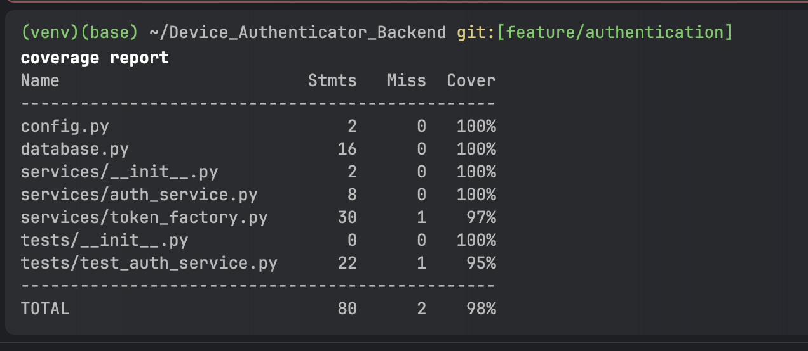

# Backend Authentication Service

This backend service is part of a **Device Authentication System** that integrates with a frontend to provide a secure email authentication flow with local device verification. The backend handles token generation, validation, and device-bound authentication to ensure only legitimate device owners can submit their email.

---

## Table of Contents

1. [Features](#features)
2. [Technologies Used](#technologies-used)
3. [Setup Instructions](#setup-instructions)
4. [API Documentation](#api-documentation)
5. [Project Structure](#project-structure)
6. [Running Tests](#running-tests)
7. [Running the Application](#running-the-application)


---

## Features

- **Device-Bound Token Generation**: Generates a time-bound token tied to a specific device.
- **Token Expiration**: Tokens expire after a configurable duration.
- **Email and Device Verification**: Validates the email and device before granting access.
- **Protected Routes**: Ensures only authenticated devices can access protected resources.
- **In-Memory Token Storage**: Tokens are stored in memory for simplicity (can be replaced with a database in production).

---

## Technologies Used

- **FastAPI**: A modern, fast (high-performance) web framework for building APIs with Python.
- **Python 3.x**: The programming language used for the backend.
- **Uvicorn**: A lightning-fast ASGI server for serving the FastAPI application.
- **Secrets**: Used for generating secure tokens.
- **Pydantic**: For data validation and settings management (used in FastAPI models).

---

## Setup Instructions

### Prerequisites

- Python 3.8 or higher installed.
- `pip` for installing dependencies.

### Steps

1. **Clone the Repository**:

   ```bash
   git clone https://github.com/your-username/your-repo-name.git
   cd your-repo-name
   ```

2. **Create a Virtual Environment**:

   ```bash
   python -m venv venv
   source venv/bin/activate  # On Windows: venv\Scripts\activate
   ```

3. **Install Dependencies**:

   ```bash
   pip install -r requirements.txt
   ```

   ```bash
   pip install fastapi uvicorn
   ```

4. **Run the Application**:

   ```bash
   python run.py
   ```

   The application will start at `http://0.0.0.0:8000`.

---

## API Documentation

### Base URL

```
http://localhost:8000
```

### Endpoints

#### 1. **Verify Email and Generate Token**

- **URL**: `/api/auth/verify`
- **Method**: `POST`
- **Request Body**:

  ```json
  {
    "email": "user@example.com",
    "device_id": "device123"
  }
  ```

- **Response**:

  ```json
  {
    "token": "generated_token_here",
    "expires_at": "2023-10-30T12:34:56.789Z"
  }
  ```

#### 2. **Access Protected Resource**

- **URL**: `/api/protected`
- **Method**: `GET`
- **Query Parameters**:
  - `token`: The token generated from the `/api/auth/verify` endpoint.
  - `device_id`: The device ID used during token generation.

- **Response**:

  ```json
  {
    "message": "You have accessed a protected resource!"
  }
  ```

- **Error Response**:

  ```json
  {
    "detail": "Invalid token or device"
  }
  ```

---

## Project Structure

```
your_project/
│
├── app.py                  # FastAPI application entry point
├── database.py             # In-memory token storage and management
├── run.py                  # Script to run the application
├── services/
│   ├── auth_service.py     # Authentication service logic
│   └── token_factory.py    # Token generation and validation logic
├── models/                 # Pydantic models 
├── config/                 # Configuration files 
├── test/                   # Unit tests
│   ├── __init__.py
│   ├── test_auth_service.py
│   ├── test_token_factory.py
│   └── test_database.py
└── README.md               # This file
```

---

## Running Tests

To run the unit tests, use the following command:

```bash
python -m unittest discover test
```

This will discover and run all test cases in the `test` directory.

Attaching the test coverage report for the repository


---

## Running the Application

To start the application, run:

```bash
python run.py
```

The application will be available at `http://0.0.0.0:8000`.

